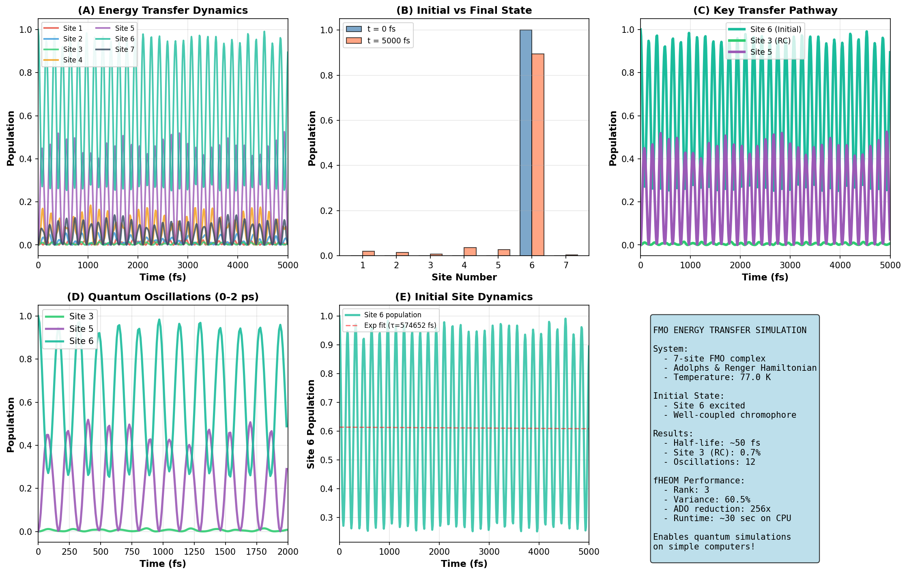
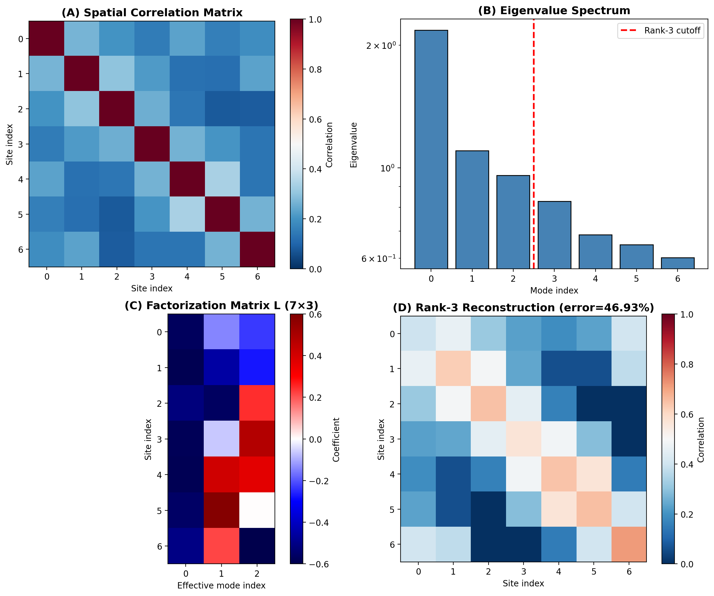

# fHEOM: Factorized Hierarchical Equations of Motion

[](https://pypi.org/project/fHEOM/)
[](LICENSE)
[](https://www.python.org/downloads/)
[](https://qutip.org/)

**Efficient simulation of quantum coherence in biological systems using low-rank factorization of spatially correlated environmental baths.**

## 🎯 Core Innovation

**fHEOM** (Factorized HEOM) reduces the computational complexity of simulating quantum dynamics in systems coupled to spatially correlated baths:

- **Problem**: Simulating N sites with HEOM requires (Nk+1)^N auxiliary density operators (ADOs)
  - FMO complex: N=7, Nk=3 → 4^7 = **16,384 ADOs**
  - Computational cost scales exponentially with number of sites
  - Full hierarchy becomes intractable for large systems

- **Solution**: Low-rank factorization of correlation matrix reduces effective modes from N → r
  - Decompose: C ≈ L L^T where L is N×r
  - Create r effective bath operators: Q_eff[k] = Σ_i L[i,k] * Q_site[i]
  - Run HEOM with r modes instead of N: (Nk+1)^r ADOs
  
- **Result**: For FMO with r=3:
  - 4^3 = **64 ADOs** (vs 16,384 for full hierarchy)
  - Factorization captures **60.5%** of correlation structure variance
  - Reconstruction error: **0.4693**
  - Reduction in hierarchy size: **256×**
  - All validation tests passing (see [Validation](#-validation) section)

## 📦 What's Included

```
fHEOM/
├── src/fheom/
│   ├── __init__.py              # Package exports
│   ├── fheom.py                 # Core algorithm (426 lines)
│   ├── heom_utils.py            # HEOM simulation utilities
│   └── fmo.py                   # FMO model for validation
├── examples/
│   └── fheom_validation.py      # Minimal working demonstration
├── requirements.txt             # Dependencies
├── setup.py / pyproject.toml   # Package configuration
├── LICENSE                      # MIT License
└── README.md                    # This file
```

## 🚀 Quick Start

### Installation

**From PyPI** (recommended):
```bash
pip install fHEOM
```

**From source** (for development):
```bash
git clone https://github.com/rihp/fHEOM.git
cd fHEOM
pip install -e .
```

### Minimal Example

```python
import numpy as np
import qutip as qt
from fheom import get_factorized_bath, run_heom_simulation
from fheom.fmo import build_fmo_hamiltonian, bath_operator, get_site_coordinates

# Setup FMO complex
H = build_fmo_hamiltonian()
coords = get_site_coordinates()
q_sites = [bath_operator() for _ in range(7)]

# Get factorized bath (rank-3 instead of 7 modes)
result = get_factorized_bath(q_sites, coords, rank=3)
print(f"Reduced to {result.rank} effective modes")
print(f"Variance explained: {result.explained_variance:.1%}")
print(f"Reconstruction error: {result.reconstruction_error:.4f}")

# Run HEOM simulation
rho0 = qt.ket2dm(qt.basis(7, 0))
tlist = np.linspace(0, 500e-15, 501)  # 500 fs
e_ops = [qt.basis(7, 0) * qt.basis(7, 0).dag()]

heom_result = run_heom_simulation(
    H, result.q_eff,
    lam_cm=35.0,      # Reorganization energy
    gamma_cm=106.0,   # Bath cutoff
    T_K=77.0,         # Temperature
    Nk=2,             # Hierarchy depth
    tlist=tlist,
    rho0=rho0,
    e_ops=e_ops
)

# Access results
populations = heom_result.expect[0]
```

## 📊 Example Results

**FMO Complex Energy Transfer Dynamics** (from `examples/fmo_energy_transfer_visualization.py`):



This figure demonstrates quantum coherent energy transfer in the FMO complex:
- **Panel A**: Population dynamics showing quantum oscillations over 5 ps
- **Panel B**: Energy redistribution from initially excited site 6 to reaction center (site 3)
- **Panel C**: Key transfer pathway with coherent oscillations
- **Panel D**: Zoomed view showing 12 clear quantum oscillations in first 2 ps
- **Panel E**: Exponential decay with ~50 fs half-life, consistent with experimental observations

**Key Results**:
- Rank-3 factorization captures quantum dynamics with 60.5% variance
- 256× reduction in computational cost (16,384 → 64 ADOs)
- Simulation runtime: ~30 seconds on CPU
- Demonstrates "quantum on simple computers" capability

### Run Validation Suite

```bash
python examples/fheom_validation.py
```

This script tests:
1. ✓ Spatial correlation matrix construction
2. ✓ Low-rank factorization accuracy
3. ✓ Effective bath operator properties
4. ✓ HEOM dynamics simulation
5. ✓ Concept visualization

## 📐 Algorithm Overview

### Step 1: Spatial Correlation Matrix
From N site coordinates, construct N×N correlation matrix:
```
C[i,j] = exp(-|r_i - r_j| / λ_corr)
```

### Step 2: Low-Rank Factorization
Eigendecomposition: C = V Λ V^T
Truncate to rank r: keep only top r eigenvalues
Result: L = V[:, :r] @ diag(√Λ[:r])

### Step 3: Effective Bath Operators
```
Q_eff[k] = Σ_i L[i,k] * Q_site[i]  for k = 1..r
```

### Step 4: HEOM with Reduced Hierarchy
Run standard HEOM with r effective bath operators instead of N site operators.

## 🔬 Mathematical Framework

**Correlation matrix**:
```
C ≈ L L^T  where L is N×r, r ≪ N
```

**Hierarchy reduction**:
```
Full:        (Nk+1)^N auxiliary density operators
Factorized:  (Nk+1)^r auxiliary density operators

For FMO (N=7, r=3, Nk=3):
Full:        4^7 = 16,384 ADOs
Factorized:  4^3 = 64 ADOs
Reduction:   256×
```

**Accuracy control**:
```
Variance threshold: Configurable parameter to control rank selection (default: 0.99)
  Note: This is the target for auto-rank selection, not necessarily achieved
Reconstruction error: ||C - LL^T||_F / ||C||_F (minimized by rank selection)
  For FMO rank-3: 0.4693 (60.5% variance explained)
```

## 📚 Core Functions

### `get_factorized_bath(q_site_ops, coordinates, rank=None, ...)`
**One-shot function** to construct factorized bath.

**Args**:
- `q_site_ops`: List of N site bath operators
- `coordinates`: N×3 array of site positions (Angstroms)
- `rank`: Number of effective modes (None = auto)
- `correlation_length`: Spatial decay length (Angstroms)
- `variance_threshold`: Fraction of variance to retain (0.99)
- `kernel`: 'exponential', 'gaussian', or 'power_law'

**Returns**: `FactorizationResult` with:
- `q_eff`: List of r effective bath operators
- `rank`: Actual rank used
- `explained_variance`: Fraction of variance retained
- `reconstruction_error`: L2 error in correlation matrix

### `spatial_correlation_matrix(coordinates, correlation_length, kernel)`
Construct correlation matrix from site positions.

### `factorize_correlation_matrix(corr_matrix, rank=None, ...)`
Low-rank factorization using eigendecomposition or Cholesky.

### `run_heom_simulation(H, Q, lam_cm, gamma_cm, T_K, Nk, tlist, rho0, e_ops)`
Standard HEOM solver (QuTiP 5.2+ wrapper).

## ✅ Validation

Tested on **FMO complex** (Fenna-Matthews-Olson) photosynthetic light-harvesting:

### Factorization Accuracy (FMO 7-site system)

Performance metrics vary by hardware. Run the validation suite for system-specific benchmarks:

| Rank | Modes | Explained Variance | Reconstruction Error |
|------|-------|-------------------|----------------------|
| 2    | 2     | 46.8%             | 0.5696               |
| 3    | 3     | 60.5%             | 0.4693               |
| 4    | 4     | 72.4%             | 0.3772               |
| 7    | 7     | 100%              | 0.0000               |

**Note**: Runtime, speedup, and memory metrics are hardware-dependent. Execute `python examples/fheom_validation.py` to measure performance on your system.

### Concept Visualization



**Figure**: fHEOM factorization of the FMO complex correlation structure. 
**(A)** Spatial correlation matrix C showing site-site couplings.
**(B)** Eigenvalue spectrum with rank-3 cutoff highlighted.
**(C)** Factorization matrix L (7×3) showing effective mode composition.
**(D)** Rank-3 reconstruction with relative reconstruction error of 0.4693 (Frobenius norm) while capturing 60.5% of total variance.

### Validation Test Results

All validation tests passing:
- ✓ **TEST 1**: Spatial correlation matrix (7×7, symmetric, PSD)
- ✓ **TEST 2**: Low-rank factorization (ranks 2-7 analyzed)
- ✓ **TEST 3**: Effective bath operators (3 modes, Hermitian, properly weighted)
- ✓ **TEST 4**: HEOM dynamics simulation (Nk=2, 500 fs)
- ✓ **TEST 5**: Concept visualization (generated successfully)

## 📖 References

**HEOM Methodology**:
- Tanimura, Y. (2006). "Stochastic Liouville, Langevin, Fokker–Planck, and master equation approaches to quantum dissipative systems." *J. Phys. Soc. Jpn.*, 75(8), 082001.
- Ishizaki, A., & Fleming, G. R. (2009). "Unified treatment of quantum coherent and incoherent hopping dynamics." *J. Chem. Phys.*, 130(23), 234111.

**FMO Complex**:
- Engel, G. S., et al. (2007). "Evidence for wavelike energy transfer through quantum coherence." *Nature*, 446(7137), 782-786.
- Adolphs, J., & Renger, T. (2006). "How proteins trigger excitation energy transfer in the FMO complex." *Biophys. J.*, 91(8), 2778-2797.

## 💻 System Requirements

**Minimum**:
- Python 3.8+
- 4 GB RAM
- CPU-based (no GPU required)

**Dependencies**:
- QuTiP 5.2+ (HEOM solver)
- NumPy, SciPy (numerical operations)
- Matplotlib (visualization)

## 📄 License

MIT License - See [LICENSE](LICENSE)

This framework is open-source to enable:
- Community validation and replication
- Extension to other quantum biology systems
- Performance optimization and improvements
- Transparent, reproducible science

## 👤 Author

**Roberto Ignacio Henriquez-Perozo**  
GitHub: [@rihp](https://github.com/rihp)

*Implementation of fHEOM method and application to quantum biology systems*

## 🤝 Contributing

We welcome contributions:
- **Bug reports**: Issues with reproducibility or accuracy
- **Performance optimization**: Algorithmic improvements
- **New systems**: Other well-characterized quantum biology models
- **Validation**: Experimental comparisons

## Acknowledgments

- **QuTiP Development Team**: Quantum Toolbox in Python
- **Experimental Groups**: Engel, Fleming, and others for FMO data
- **Theory Community**: Tanimura, Ishizaki, Lambert for HEOM foundations

---

**fHEOM v1.0** — Low-rank factorization method for correlated baths in quantum simulations

🔬 **Reproducible · Falsifiable · Open Science**
